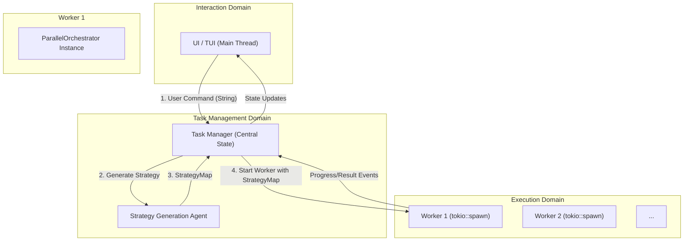
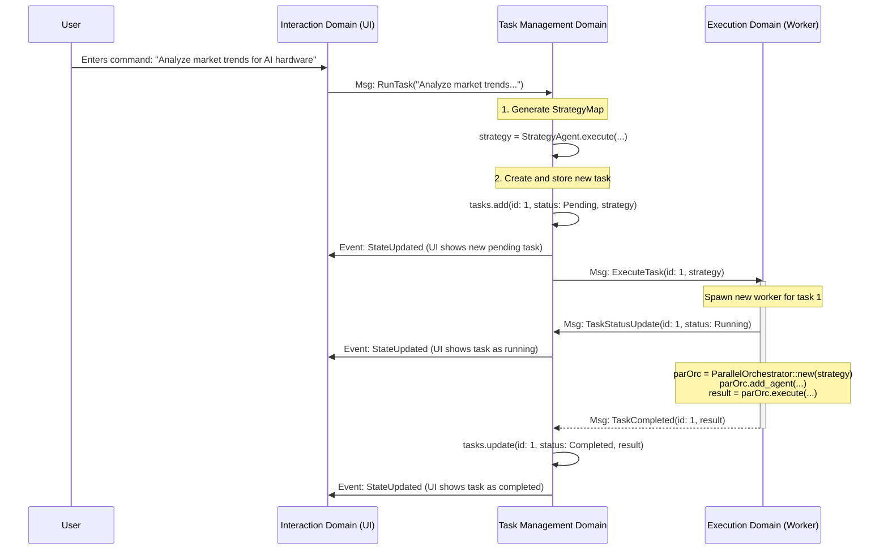

# Architecture Design: Asynchronous, Multi-Tasking AI Assistant

## 1. Concept: A Seamless Partnership with AI

This document outlines the architecture for a new generation of CLI tool, designed to be a true AI partner.

The core concept is to create an environment where the user can maintain a fluid, continuous dialogue with an AI assistant, while delegating complex, time-consuming tasks to be executed in the background. The user's interaction should **never be blocked**. While they chat, plan, or ask follow-up questions, the AI is concurrently researching, analyzing, and generating results for previously assigned tasks.

This creates a seamless user experience, transforming the AI from a simple request/response tool into a proactive, multi-tasking assistant that works alongside the user.

---

## 2. Architecture Decision Record (ADR)

**Title:** Event-Driven, Multi-Domain Architecture for Asynchronous Task Management

**Status:** Proposed

### Context

The primary business requirement is to build a CLI application that allows a user to interact with an AI (dialogue) while concurrently executing long-running AI tasks (jobs) in the background.

This imposes several technical challenges:
1.  **UI Blocking Avoidance:** The main thread responsible for user interaction must remain responsive at all times and cannot be blocked by I/O or heavy computation from AI tasks.
2.  **Concurrent State Management:** The state of multiple background tasks (e.g., their progress, results, or failures) must be safely managed and reflected in the UI without race conditions.
3.  **Asynchronous Event Handling:** The application must be able to handle events originating from background workers (e.g., "task complete," "error occurred") and update the central state and UI accordingly.
4.  **Component Reusability:** The architecture must leverage existing powerful components, specifically the `ParallelOrchestrator`, for task execution.

### Decision

We will adopt an **event-driven, multi-domain architecture** composed of three distinct, loosely-coupled domains:

1.  **Interaction Domain:** Responsible solely for the user interface (UI/TUI), input parsing, and rendering state.
2.  **Task Management Domain:** The central brain of the application. It manages the lifecycle of all tasks, including their state (`Pending`, `Running`, `Completed`). It is also responsible for generating the `StrategyMap` for each task.
3.  **Execution Domain:** Responsible for executing a single, complex task using the `ParallelOrchestrator`. Each task runs in its own isolated worker.

Communication between these domains will be handled exclusively through **asynchronous message passing** (e.g., using `tokio::mpsc::channel`). This ensures that the domains are decoupled and do not block each other.

The `ParallelOrchestrator` will be the core component of the **Execution Domain**. It will not be a globally shared resource, but rather will be instantiated within each worker to execute a specific `StrategyMap`.

### Consequences

#### Positive:
*   **High Responsiveness:** The separation of the Interaction Domain ensures the UI is never blocked by background processing.
*   **Strong Separation of Concerns (SoC):** Each domain has a clear, single responsibility, making the codebase easier to understand, maintain, and test.
*   **Scalability & Extensibility:** Adding new agents or modifying task execution logic only affects the Execution Domain. UI changes are isolated to the Interaction Domain.
*   **Robustness:** The failure of a single task in the Execution Domain is isolated and can be managed by the Task Management Domain without crashing the entire application.
*   **Effective Reuse:** `ParallelOrchestrator` is used as intended—as a powerful engine for executing a predefined strategy—without being burdened with global state management.

#### Negative:
*   **Increased Initial Complexity:** This architecture is more complex to set up than a simple, monolithic REPL application.
*   **Message-Passing Overhead:** Requires careful design of the messages (events) that are passed between domains.

### Considered Options

1.  **Simple State Machine / Monolithic REPL:**
    *   A single loop handles input, processing, and output.
    *   *Rejected because:* It cannot handle concurrent background tasks without blocking the UI, and it has poor scalability.
2.  **Synchronous Command Pattern:**
    *   Commands are encapsulated, but execution is synchronous.
    *   *Rejected because:* It does not solve the UI blocking problem for long-running commands.
3.  **The Chosen Event-Driven Architecture:**
    *   *Chosen because:* It directly addresses all core technical challenges, providing a robust and scalable foundation for the application's requirements.

---

## 3. Detailed Architecture

### Overall Component Diagram



### Domain Responsibilities

#### 1. Interaction Domain
*   **Responsibility:** To be the sole interface with the user.
*   **Components:** TUI rendering loop (`ratatui`, `crossterm`), command parser.
*   **Logic:**
    *   Listens for user input.
    *   Renders the current state (chat history, task list) provided by the Task Management Domain.
    *   Forwards user commands as messages to the Task Management Domain.

#### 2. Task Management Domain
*   **Responsibility:** To be the single source of truth for the application's state.
*   **Components:** Central `AppState` struct (holding `Vec<TaskContext>`, etc.), `Strategy Generation Agent`.
*   **Logic:**
    *   Receives a user command (e.g., a raw prompt string) from the Interaction Domain.
    *   Invokes a dedicated `Strategy Generation Agent` to create a `StrategyMap` for the task.
    *   Creates a new `TaskContext` with a unique ID and `Pending` status, and adds it to the central state.
    *   Sends a message to the Execution Domain to start a new worker for the task.
    *   Receives progress/completion events from the Execution Domain and updates the corresponding `TaskContext`.
    *   Notifies the Interaction Domain whenever the state changes so the UI can be re-rendered.

#### 3. Execution Domain
*   **Responsibility:** To execute a single task to completion.
*   **Components:** A pool of dynamically spawned workers. Each worker contains its own instance of `ParallelOrchestrator`.
*   **Logic (within each worker):**
    1.  Receives a message with a `task_id` and `StrategyMap`.
    2.  Instantiates `ParallelOrchestrator` with the received `StrategyMap`.
    3.  Registers all available agents (e.g., from a shared, dependency-injected registry).
    4.  Calls `orchestrator.execute(...)`.
    5.  During execution, sends status update messages (e.g., `TaskRunning`, `TaskPaused`) to the Task Management Domain.
    6.  Upon completion, sends a final `TaskCompleted` or `TaskFailed` message with the result.

---

## 4. Example Workflow: User Requests a Task



---

## 5. Repository and Crate Structure

**Project Name:** `orcs`

To ensure a clean, maintainable, and extensible codebase, the project will be structured as a Cargo workspace with five distinct crates. This design separates the UI rendering from the application's core logic domains, enabling future expansion to different frontends (e.g., web, desktop).

### Workspace Structure

```text
orcs/
├── Cargo.toml       # Workspace definition
├── .gitignore
├── README.md
└── crates/
    ├── orcs-cli/         # 1. UI/TUI Frontend (Binary)
    ├── orcs-interaction/ # 2. Conversation Domain
    ├── orcs-core/        # 3. Task Management Domain
    ├── orcs-execution/   # 4. Execution Domain
    └── orcs-types/       # 5. Shared Types
```

### Crate Responsibilities

#### 1. `orcs-types` (Shared Types)
*   **Role:** Defines shared data structures, such as `TaskContext`, `TaskStatus`, and inter-domain message enums. Contains no logic. It is the "common language" for all other crates.
*   **Dependencies:** None within the workspace.

#### 2. `orcs-interaction` (Conversation Domain)
*   **Role:** The "brain" for dialogue. Manages conversation history, interprets user input to distinguish between conversation and commands, and generates AI responses for dialogue.
*   **Dependencies:** `orcs-types`.

#### 3. `orcs-core` (Task Management Domain)
*   **Role:** The "brain" for tasks. Manages the lifecycle of all background tasks. It receives structured commands from the `orcs-interaction` domain to create and manage tasks.
*   **Dependencies:** `orcs-types`.

#### 4. `orcs-execution` (Execution Domain)
*   **Role:** The "hands" of the application. Executes tasks using `ParallelOrchestrator`. Each task runs in an isolated worker.
*   **Dependencies:** `orcs-types`, `llm-toolkit`.

#### 5. `orcs-cli` (UI Frontend)
*   **Role:** The "face" of the application. A pure UI renderer responsible for the TUI event loop. It forwards raw UI events (like key presses) to the appropriate domains and renders the state it receives from them. It contains minimal logic.
*   **Dependencies:** `orcs-types`, `orcs-interaction`, `orcs-core`, `orcs-execution` (for initialization and wiring).

### Crate Dependency Graph

This structure establishes a clear, one-way dependency flow, preventing circular dependencies and promoting high cohesion and low coupling.

```mermaid
graph TD
    subgraph orcs (Repository)
        orcs_cli["orcs-cli (UI/Binary)"]
        orcs_interaction["orcs-interaction (Conversation Domain)"]
        orcs_core["orcs-core (Task Mgmt Domain)"]
        orcs_execution["orcs-execution (Execution Domain)"]
        orcs_types["orcs-types (Shared)"]
    end

    orcs_cli --> orcs_interaction
    orcs_cli --> orcs_core
    orcs_cli --> orcs_execution

    orcs_interaction --> orcs_types
    orcs_core --> orcs_types
    orcs_execution --> orcs_types
```